# Kenya TNT System - Entity Relationship Diagram (ERD)

**Generated:** 2025-01-20  
**Last Updated:** 2025-12-14 (V09: Address normalization, parties table, supplier_roles)  
**Database:** kenya_tnt_db (PostgreSQL 15.8 with PostGIS)  
**Total Tables:** 35  
**Total Indexes:** 145+  
**Foreign Key Relationships:** 52+

---

## Visual ERD (Mermaid)

```mermaid
erDiagram
    users ||--o{ batches : creates
    users ||--o{ shipments : creates
    users ||--o{ packages : creates
    users ||--o{ cases : creates
    users ||--o{ consignments : creates
    users ||--o{ epcis_events : "actor"
    users ||--o{ product_status : "actor"
    users ||--o{ product_destruction : "facility"
    users ||--o{ product_returns : "from/to"
    users ||--o{ facility_receiving : "facility"
    users ||--o{ facility_dispensing : "facility"
    users ||--o{ facility_inventory : "facility"

    ppb_products ||--o{ batches : "has"
    ppb_products ||--o{ ppb_batches : "has"
    ppb_products ||--o{ product_status : "has"
    ppb_products ||--o{ product_destruction : "has"
    ppb_products ||--o{ product_returns : "has"
    ppb_products ||--o{ product_verifications : "has"
    ppb_products ||--o{ facility_dispensing : "has"
    ppb_products ||--o{ facility_inventory : "has"
    ppb_products ||--o{ ppb_product_to_program_mapping : "has"

    batches ||--o{ cases_products : "in"
    batches ||--o{ consignment_batches : "in"
    batches ||--o{ serial_numbers : "has"
    batches ||--o{ recall_requests : "recalled"
    batches ||--o{ product_status : "has"
    batches ||--o{ product_destruction : "has"
    batches ||--o{ product_returns : "has"
    batches ||--o{ product_verifications : "has"
    batches ||--o{ facility_dispensing : "has"
    batches ||--o{ facility_inventory : "has"

    shipment ||--o{ packages : "contains"
    shipment ||--o{ facility_receiving : "received"

    packages ||--o{ cases : "contains"

    cases ||--o{ cases_products : "has"

    cases_products }o--|| ppb_products : "references"
    cases_products }o--|| batches : "references"

    consignments ||--o{ consignment_batches : "has"
    consignments ||--o{ serial_numbers : "has"
    consignments ||--o{ facility_receiving : "received"

    consignment_batches }o--|| batches : "references"

    epcis_events ||--o{ epcis_event_epcs : "has"

    suppliers ||--o{ premises : "has"
    suppliers ||--o{ supplier_roles : "has"
    suppliers }o--o| locations : "hq_location"
    
    premises }o--o| suppliers : "belongs_to"
    premises }o--o| locations : "location"
    
    logistics_providers }o--o| locations : "hq_location"
    
    parties ||--o{ batches : "manufacturer"
    parties ||--o{ product_manufacturers : "party"
    
    locations ||--o{ premises : "has"
    locations ||--o{ suppliers : "has"
    locations ||--o{ logistics_providers : "has"

    users {
        uuid id PK
        string email UK
        enum role
        string gln_number
        string organization
    }

    ppb_products {
        int id PK
        string etcd_product_id UK
        string GTIN
        enum category
        string productName
        string brandName
        string genericName
    }

    batches {
        int id PK
        int productId FK
        uuid userId FK
        string batchno UK
        date expiry
        numeric qty
        numeric sentQty
    }

    shipment {
        int id PK
        uuid userId FK
        string sscc_barcode UK
        string customer
        date pickup_date
        point pickup_location_point
        point destination_location_point
    }

    packages {
        int id PK
        int shipmentId FK
        uuid userId FK
        string sscc_barcode
        string label
    }

    cases {
        int id PK
        int packageId FK
        uuid userId FK
        string sscc_barcode
        string label
    }

    consignments {
        int id PK
        uuid userId FK
        string eventID UK
        string consignmentID
        string manufacturerPPBID
        string MAHPPBID
    }

    epcis_events {
        int id PK
        string event_id UK
        string event_type
        string parent_id
        uuid actor_user_id FK
        string actor_type
        string actor_gln
        string source_entity_type
        int source_entity_id
    }

    epcis_event_epcs {
        int id PK
        string event_id FK
        string epc UK
        string epc_type
    }

    product_status {
        int id PK
        int product_id FK
        int batch_id FK
        string sgtin
        string status
        uuid actor_user_id FK
    }

    product_destruction {
        int id PK
        int product_id FK
        int batch_id FK
        uuid facility_user_id FK
        numeric quantity
        string destruction_reason
    }

    product_returns {
        int id PK
        int product_id FK
        int batch_id FK
        uuid from_actor_user_id FK
        uuid to_actor_user_id FK
        string return_type
        string return_reason
    }

    product_verifications {
        int id PK
        string sgtin
        int product_id FK
        int batch_id FK
        uuid verifier_user_id FK
        string verification_result
    }

    facility_receiving {
        int id PK
        uuid facility_user_id FK
        int shipment_id FK
        int consignment_id FK
        numeric received_quantity
    }

    facility_dispensing {
        int id PK
        uuid facility_user_id FK
        int product_id FK
        int batch_id FK
        string sgtin
        numeric quantity
        string patient_id
    }

    facility_inventory {
        int id PK
        uuid facility_user_id FK
        int product_id FK
        int batch_id FK
        numeric quantity
        numeric reserved_quantity
    }
```



---

## Supply Chain Flow Diagram

```
┌─────────────┐
│   users     │ (Manufacturer/Supplier)
└──────┬──────┘
       │
       ├─────────────────────────────┐
       │                             │
       ▼                             ▼
┌──────────────┐              ┌──────────────┐
│ ppb_products │              │   shipment   │
│ (master data)│              │              │
└──────┬───────┘              └──────┬───────┘
       │                             │
       ▼                             │
┌──────────┐                         │
│ batches  │                         │
└────┬─────┘                         │
     │                               │
     ├───────────────────────────────┼──────────────┐
     │                               │              │
     ▼                               ▼              ▼
┌──────────────┐              ┌──────────┐ ┌──────────┐
│ consignments │              │ packages │ │ packages │
│  (PPB)       │              └────┬─────┘ └────┬─────┘
└──────┬───────┘                  │            │
       │                          │            │
       ├──────────────┐           ▼            ▼
       │              │      ┌──────────┐ ┌──────────┐
       ▼              ▼      │  cases   │ │  cases   │
┌──────────────┐ ┌──────────┐ └────┬─────┘ └────┬─────┘
│consignment_  │ │ serial_  │      │            │
│  batches     │ │ numbers  │      └─────┬──────┘
└──────────────┘ └──────────┘            │
                                         ▼
                                ┌──────────────┐
                                │cases_products│
                                └──────────────┘
```

---

## L5 TNT Analytics Flow

```
┌─────────────┐
│   users     │ (All Actors)
└──────┬──────┘
       │
       ├─────────────────────────────────────────────────────────┐
       │                                                         │
       ▼                                                         ▼
┌──────────────────┐                                    ┌──────────────────┐
│ product_status   │                                    │ epcis_events     │
│ (lifecycle)      │                                    │ (normalized)     │
└──────────────────┘                                    └────────┬─────────┘
                                                                  │
       ┌──────────────────────────────────────────────────────────┘
       │
       ▼
┌──────────────────┐
│epcis_event_epcs  │
│ (EPC lookups)    │
└──────────────────┘

┌──────────────────┐
│product_destruction│
│ (compliance)     │
└──────────────────┘

┌──────────────────┐
│ product_returns  │
│ (reverse log)    │
└──────────────────┘

┌──────────────────┐
│product_          │
│ verifications    │
│ (counterfeit)    │
└──────────────────┘

┌──────────────────┐
│facility_receiving│
│ (operations)     │
└──────────────────┘

┌──────────────────┐
│facility_dispensing│
│ (consumption)    │
└──────────────────┘

┌──────────────────┐
│facility_inventory│
│ (stock levels)   │
└──────────────────┘
```

---

## Core Entities

### 1. users
**Primary Key:** id (UUID)  
**Description:** Centralized user accounts for all system actors  
**Relationships:**
- One-to-Many: batches, shipments, packages, cases, consignments, recall_requests, ppb_activity_logs, batch_notification_settings
- One-to-Many: epcis_events (actor_user_id)
- One-to-Many: epcis_events (actor_user_id)
- One-to-Many: product_status (actor_user_id)
- One-to-Many: product_destruction (facility_user_id)
- One-to-Many: product_returns (from_actor_user_id, to_actor_user_id)
- One-to-Many: product_verifications (verifier_user_id)
- One-to-Many: facility_receiving (facility_user_id, received_by)
- One-to-Many: facility_dispensing (facility_user_id, dispensed_by)
- One-to-Many: facility_inventory (facility_user_id)

**Key Fields:**
- email (unique)
- role (enum: dha, user_facility, manufacturer, cpa)
- gln_number
- organization

---

### 2. ppb_products (Master Data - Active)
**Primary Key:** id  
**Description:** Product catalog from PPB Terminology API - authoritative source  
**Relationships:**
- One-to-Many: batches (productId)
- One-to-Many: ppb_batches
- One-to-Many: cases_products

**Key Fields:**
- etcd_product_id (unique) - PPB product identifier, prefix indicates category (PH=medicine, FS=supplement, MD=medical_device, CO=cosmetic)
- category (enum) - Product category extracted from etcd_product_id prefix: 'medicine', 'supplement', 'medical_device', 'cosmetic'
- GTIN - Global Trade Item Number
- brandName - Brand name
- genericName - Generic name
- brandDisplayName - Brand display name with strength/form
- genericDisplayName - Generic display name with strength/form
- ppbRegistrationCode - PPB registration code

---

### 3. products (REMOVED - Legacy)
**Status:** ✅ **REMOVED** - This legacy table has been completely removed. All product references now use `ppb_products`.

---

### 4. batches
**Primary Key:** id  
**Foreign Keys:**
- productId → ppb_products(id) ✅
- userId → users(id)

**Relationships:**
- One-to-Many: cases_products
- One-to-Many: consignment_batches
- One-to-Many: serial_numbers
- One-to-Many: recall_requests
- One-to-Many: product_status
- One-to-Many: product_destruction
- One-to-Many: product_returns
- One-to-Many: product_verifications
- One-to-Many: facility_dispensing
- One-to-Many: facility_inventory

**Key Fields:**
- batchno (unique)
- expiry
- qty (NUMERIC)
- sentQty (NUMERIC)

---

## Supply Chain Hierarchy

### 5. shipment
**Primary Key:** id  
**Foreign Keys:**
- userId → users(id)

**Relationships:**
- One-to-Many: packages
- One-to-Many: facility_receiving

**Key Fields:**
- sscc_barcode (unique)
- customer
- pickup_date
- expected_delivery_date
- pickup_location_point (PostGIS POINT)
- destination_location_point (PostGIS POINT)

---

### 6. packages
**Primary Key:** id  
**Foreign Keys:**
- shipmentId → shipment(id)
- userId → users(id)

**Relationships:**
- One-to-Many: case

**Key Fields:**
- sscc_barcode (optional, unique when not null)
- label
- eventId

---

### 7. case
**Primary Key:** id  
**Foreign Keys:**
- packageId → packages(id)
- userId → users(id)

**Relationships:**
- One-to-Many: cases_products

**Key Fields:**
- sscc_barcode (optional, unique when not null)
- label (unique per user)
- eventId

---

### 8. cases_products (Junction Table)
**Primary Key:** id  
**Foreign Keys:**
- caseId → case(id)
- productId → ppb_products(id) ✅
- batchId → batches(id)

**Description:** Links cases to products/batches with quantities

---

## PPB Consignments

### 9. consignments
**Primary Key:** id  
**Foreign Keys:**
- userId → users(id)

**Relationships:**
- One-to-Many: consignment_batches
- One-to-Many: serial_numbers
- One-to-Many: facility_receiving

**Key Fields:**
- eventID (unique)
- consignmentID
- manufacturerPPBID
- MAHPPBID
- manufacturerGLN
- MAHGLN

---

### 10. consignment_batches (Junction Table)
**Primary Key:** id  
**Foreign Keys:**
- consignmentId → consignments(id)
- batchId → batches(id)

**Key Fields:**
- sscc

---

### 11. serial_numbers
**Primary Key:** id  
**Foreign Keys:**
- batchId → batches(id)
- consignmentId → consignments(id)

**Key Fields:**
- serial_number (unique per batch)

---

## Master Data

### 12. suppliers
**Primary Key:** id  
**Foreign Keys:**
- hq_location_id → locations(id) (V08)

**Relationships:**
- One-to-Many: premises
- One-to-Many: supplier_roles (V07)
- Many-to-One: locations (hq_location)

**Key Fields:**
- entityId (unique)
- legalEntityName
- actorType ('supplier' | 'manufacturer')
- gs1Prefix
- legalEntityGLN
- hqLocationId (V08)
- hqCounty, hqWard (V09 - restored for analytics)

**Notes:**
- `actorType` differentiates suppliers from manufacturers (both stored here)
- `roles` moved to `supplier_roles` table in V07 for normalization
- V09 introduced dual-pattern: geographic fields on entity + FK to locations

---

### 13. supplier_roles (V07)
**Primary Key:** id  
**Foreign Keys:**
- supplier_id → suppliers(id) ON DELETE CASCADE

**Key Fields:**
- role (VARCHAR 50) - e.g., "National Distributor", "Wholesaler", "MAH"

**Unique Constraint:** (supplier_id, role)

**Description:** Normalized supplier roles table. Replaces the old `roles` text array column on suppliers. One supplier can have multiple roles.

---

### 14. parties (V03/V07)
**Primary Key:** id  
**Foreign Keys:** None (top-level entity)

**Relationships:**
- One-to-Many: batches (manufacturer_party_id)
- One-to-Many: product_manufacturers (party_id)

**Key Fields:**
- name
- ppb_id
- gln
- partyType ('manufacturer' | 'supplier' | 'importer' | 'distributor' | 'logistics_provider')
- country

**Unique Constraint:** (gln, partyType)

**Description:** Unified party model for EPCIS compliance. All supply chain actors (manufacturers, suppliers, etc.) represented here. Used for batch tracking and consignment party roles.

---

### 15. locations (V08)
**Primary Key:** id  
**Foreign Keys:** None (referenced by multiple entities)

**Relationships:**
- One-to-Many: premises (location_id)
- One-to-Many: suppliers (hq_location_id)
- One-to-Many: logistics_providers (hq_location_id)

**Key Fields:**
- sgln (unique) - Standard GS1 Location Number with Extension
- label - Human-readable location name
- locationType - e.g., "warehouse", "hq", "facility"
- addressLine1, addressLine2 (optional - PPB doesn't provide)
- city, county, constituency, ward
- postalCode, country

**Description:** Normalized address/location table supporting hierarchical precision:
- Level 1: County only (`KE-NAIROBI`)
- Level 2: County + Ward (`KE-NAIROBI-PARKLANDS`)
- Level 3: Full address (if available)

---

### 16. premises
**Primary Key:** id  
**Foreign Keys:**
- supplier_id → suppliers(id)
- location_id → locations(id) (V08)

**Relationships:**
- Many-to-One: suppliers
- Many-to-One: locations

**Key Fields:**
- premiseId (unique)
- legacyPremiseId (PPB premise ID)
- premiseName
- gln (nullable - not provided by PPB API)
- businessType
- superintendentName, superintendentCadre
- licenseValidUntil
- county, constituency, ward (V09 - restored for fast analytics)
- locationId (V08 - for EPCIS compliance)
- country

**Notes:**
- V09 dual-pattern: Direct geographic columns (`county`, `ward`) for fast analytics + `location_id` FK for EPCIS events
- 11,533+ records from PPB Catalogue API
- GLN not provided by PPB - assigned separately

---

### 17. logistics_providers
**Primary Key:** id  
**Foreign Keys:**
- hq_location_id → locations(id) (V08)

**Relationships:**
- Many-to-One: locations (hq_location)

**Key Fields:**
- lspId (unique)
- name
- registrationNumber
- gln, gs1Prefix
- hqLocationId (V08)
- hqCounty (V09 - restored for analytics)

**Notes:**
- V09 restored `hqCounty` for fast analytics queries
- Also linked to `locations` table for detailed addresses

---

## PPB Data

### 15. ppb_batches
**Primary Key:** id  
**Foreign Keys:**
- productId → ppb_products(id)

**Description:** PPB approved batches

---

### 16. ppb_activity_logs
**Primary Key:** id  
**Foreign Keys:**
- userId → users(id)

**Key Fields:**
- action
- entity_type
- entity_id
- details (JSONB)

---

## EPCIS Events

### 17. epcis_event_summary (REMOVED - Legacy)
**Status:** ✅ **REMOVED** - This denormalized table has been completely removed. All EPCIS events now use the normalized `epcis_events` and `epcis_event_epcs` tables.

---

### 18. epcis_events (Normalized - Active)
**Primary Key:** id  
**Foreign Keys:**
- actor_user_id → users(id)

**Relationships:**
- One-to-Many: epcis_event_epcs

**Key Fields:**
- event_id (unique)
- event_type
- parent_id
- actor_type
- actor_gln
- actor_organization
- source_entity_type
- source_entity_id

**Status:** ✅ Active - All new EPCIS events write here

---

### 19. epcis_event_epcs (Junction Table)
**Primary Key:** id  
**Foreign Keys:**
- event_id → epcis_events(event_id)

**Key Fields:**
- epc (indexed for fast lookups) ⚡
- epc_type (SGTIN, SSCC, BATCH_URI)

**Unique Constraint:** (event_id, epc)

**Benefits:**
- Fast EPC lookups (indexed `epc` column)
- Better analytics (query by specific EPCs)
- More flexible (can add EPC metadata)

---

## L5 TNT Analytics Tables

### 20. product_status
**Primary Key:** id  
**Foreign Keys:**
- product_id → ppb_products(id) ✅
- batch_id → batches(id)
- actor_user_id → users(id)

**Key Fields:**
- status (ACTIVE, LOST, STOLEN, DAMAGED, SAMPLE, EXPORT, DISPENSING)
- previous_status
- sgtin
- status_date

---

### 21. product_destruction
**Primary Key:** id  
**Foreign Keys:**
- product_id → ppb_products(id) ✅
- batch_id → batches(id)
- facility_user_id → users(id)

**Key Fields:**
- quantity
- destruction_reason
- destruction_date
- compliance_document_url
- witness_name

---

### 22. product_returns
**Primary Key:** id  
**Foreign Keys:**
- product_id → ppb_products(id) ✅
- batch_id → batches(id)
- from_actor_user_id → users(id)
- to_actor_user_id → users(id)

**Key Fields:**
- return_type (RETURN_RECEIVING, RETURN_SHIPPING)
- return_reason
- quantity
- status (PENDING, PROCESSED, REJECTED)

---

### 23. product_verifications
**Primary Key:** id  
**Foreign Keys:**
- product_id → ppb_products(id) ✅
- batch_id → batches(id)
- verifier_user_id → users(id)

**Key Fields:**
- sgtin (indexed)
- verification_result (VALID, INVALID, COUNTERFEIT, EXPIRED)
- verification_timestamp
- is_consumer_verification
- ip_address

---

### 24. facility_receiving
**Primary Key:** id  
**Foreign Keys:**
- facility_user_id → users(id)
- shipment_id → shipment(id)
- consignment_id → consignments(id)
- received_by → users(id)

**Key Fields:**
- received_quantity
- expected_quantity
- discrepancy_quantity
- received_date

---

### 25. facility_dispensing
**Primary Key:** id  
**Foreign Keys:**
- facility_user_id → users(id)
- product_id → ppb_products(id) ✅
- batch_id → batches(id)
- dispensed_by → users(id)

**Key Fields:**
- sgtin
- quantity
- dispensing_date
- patient_id
- prescription_number

---

### 26. facility_inventory
**Primary Key:** id  
**Foreign Keys:**
- facility_user_id → users(id)
- product_id → ppb_products(id) ✅
- batch_id → batches(id)

**Key Fields:**
- quantity
- reserved_quantity

**Unique Constraint:** (facility_user_id, product_id, batch_id)

---

## Other Tables

### 27. recall_requests
**Primary Key:** id  
**Foreign Keys:**
- batchId → batches(id)

**Key Fields:**
- status (PENDING, IN_PROGRESS, COMPLETED, CANCELLED)
- reason
- transporter

---

### 28. batch_notification_settings
**Primary Key:** id  
**Foreign Keys:**
- userId → users(id)

**Key Fields:**
- early_warning_enabled
- secondary_warning_enabled
- final_warning_enabled
- post_expiry_warning_enabled

---

### 29. ppb_product_to_program_mapping
**Primary Key:** id  
**Foreign Keys:**
- ppb_product_id → ppb_products(id) ✅

**Key Fields:**
- program_code (indexed)
- program_name
- Unique constraint: (ppb_product_id, program_code)

**Description:** Many-to-many relationship mapping PPB products to healthcare programs (e.g., Essential Commodities, ARV, Malaria). Enables program-based product filtering and analytics.

**Relationships:**
- Many-to-One: ppb_products

---

### 30. product_manufacturers (REMOVED - Legacy)
**Status:** ✅ **REMOVED** - This legacy junction table has been completely removed.

---

## Entity Relationship Summary

### Core Hierarchy
```
users
  ├── ppb_products (master data - active)
  │   └── batches
  │       ├── cases_products
  │       ├── recall_requests
  │       ├── serial_numbers
  │       └── ppb_batches
  ├── shipments
  │   └── packages
  │       └── cases
  │           └── cases_products
  └── consignments
      ├── consignment_batches
      └── serial_numbers
```

### L5 TNT Analytics
```
users
  ├── product_status (⚠️ references legacy products)
  ├── product_destruction (⚠️ references legacy products)
  ├── product_returns (⚠️ references legacy products)
  ├── product_verifications (⚠️ references legacy products)
  ├── facility_receiving
  ├── facility_dispensing (⚠️ references legacy products)
  └── facility_inventory (⚠️ references legacy products)
```

### EPCIS Events
```
epcis_events (normalized - active)
  └── epcis_event_epcs (one-to-many EPCs)

epcis_event_summary (denormalized - legacy)
```

### Master Data
```
parties (unified party model)
  ├── batches (manufacturer_party_id)
  └── product_manufacturers (party_id)

suppliers (includes manufacturers via actorType)
  ├── premises (supplier_id)
  ├── supplier_roles (supplier_id) [V07]
  └── locations (hq_location_id) [V08]

premises
  ├── supplier (supplier_id)
  └── location (location_id) [V08]
     └── Dual-pattern [V09]:
         ├── county/ward directly on premises (fast analytics)
         └── location FK (EPCIS compliance)

logistics_providers
  └── locations (hq_location_id) [V08]

locations (normalized addresses) [V08]
  ├── Hierarchical precision support
  └── Referenced by premises, suppliers, logistics_providers
```

---

## Key Relationships

1. **Supply Chain Flow:**
   - shipment → packages → cases → cases_products → batches → ppb_products

2. **PPB Consignment Flow:**
   - consignments → consignment_batches → batches
   - consignments → serial_numbers → batches

3. **EPCIS Event Tracking:**
   - All supply chain entities generate EPCIS events
   - Events stored in normalized `epcis_events` + `epcis_event_epcs`
   - Actor context tracked for L5 TNT analytics

4. **L5 TNT Analytics:**
   - Product lifecycle: product_status, product_destruction, product_returns
   - Verification: product_verifications
   - Facility operations: facility_receiving, facility_dispensing, facility_inventory

---

## Indexes (Critical for Performance)

### Actor Context Indexes
- `idx_epcis_events_actor_type`
- `idx_epcis_events_actor_user_id`
- `idx_epcis_events_actor_gln`

### EPC Lookup Indexes
- `idx_epcis_event_epcs_epc` ⚡ (Critical for fast EPC lookups)
- `idx_epcis_event_epcs_epc_type`

### Product/Batch Indexes
- `idx_product_status_sgtin`
- `idx_product_verifications_sgtin`
- `idx_batches_batchno`
- `idx_ppb_products_GTIN`
- `idx_ppb_products_category` - Index on category enum for filtering

### Geographic Indexes (PostGIS)
- `idx_shipment_pickup_location` (GIST)
- `idx_shipment_destination_location` (GIST)

---

## Recent Migrations (December 2025)

### V07: Unified Party Model & Supplier Role Normalization
**Date:** December 14, 2025  
**Status:** ✅ Applied

**Changes:**
- Created `parties` table for unified party model (manufacturers, suppliers, importers, etc.)
- Normalized `supplier_roles` table (replaced `roles` text array on suppliers)
- Updated `batches.manufacturer_party_id` to reference `parties` table
- Updated `product_manufacturers` to use `party_id` instead of `manufacturer_id`

### V08: Address Normalization (Initial)
**Date:** December 14, 2025  
**Status:** ⚠️ Applied then corrected by V09

**Changes:**
- Created `locations` table for normalized addresses
- Added `location_id` FK to premises, suppliers, logistics_providers
- Migrated addresses from existing records
- **Issue:** Only migrated premises with `address_line1`, causing data loss

### V09: Address Correction & Dual-Pattern Architecture
**Date:** December 14, 2025  
**Status:** ✅ Applied

**Changes:**
- Restored `county`, `constituency`, `ward` columns to `premises` table
- Restored `hqCounty`, `hqWard` to `suppliers` table
- Restored `hqCounty` to `logistics_providers` table
- Implemented dual-pattern:
  - Geographic columns directly on entities (fast analytics, no JOINs)
  - `location_id` FK for EPCIS compliance and future detailed addresses
- Updated `locations` table to support hierarchical precision (county/ward without street addresses)
- Linked ALL premises to locations (not just those with addresses)

**Rationale:** PPB API provides county/ward but NOT street addresses. V09 allows:
- Fast analytics queries on geographic data (no JOINs needed)
- EPCIS-compliant location references via `location_id`
- Hierarchical location precision (county-only, county+ward, full address)

---

## Migration Requirements

### ✅ Legacy Tables Migration - COMPLETED

**Status:** ✅ **COMPLETED** - All legacy tables have been removed.

**Completed Migrations:**
1. ✅ Updated all L5 TNT tables to reference `ppb_products` instead of `products`
2. ✅ Removed `epcis_event_summary` table (replaced by normalized `epcis_events` + `epcis_event_epcs`)
3. ✅ Removed `products` table (replaced by `ppb_products`)
4. ✅ Recreated `product_programs` as `ppb_product_to_program_mapping` (references `ppb_products`)
5. ✅ Removed `product_manufacturers` junction table (manufacturer info stored as JSONB in `ppb_products.manufacturers`)

**All foreign keys now correctly reference:**
- `ppb_products` for product master data
- `epcis_events` + `epcis_event_epcs` for EPCIS event data

---

## Notes

1. **Normalized vs Denormalized:**
   - `epcis_events` + `epcis_event_epcs` = Normalized (faster EPC lookups) ✅ Active
   - `epcis_event_summary` = Denormalized (legacy, kept for backward compatibility)

2. **Product Tables:**
   - `ppb_products` = Master data (active) ✅
   - `products` = Legacy (being phased out) ⚠️ Still referenced by L5 TNT tables

3. **Actor Context:**
   - All EPCIS events now track actor (manufacturer, supplier, facility, ppb)
   - Enables actor-based analytics for L5 TNT

4. **L5 TNT Readiness:**
   - All P0 tables created and indexed
   - Actor context in events
   - Product lifecycle tracking
   - Facility operations tracking
   - ⚠️ **Pending:** Migrate L5 TNT tables from `products` to `ppb_products`

---

## Database Health Check

✅ **Migrations Applied:**
- V5__Add_L5_TNT_Analytics_Tables.sql - ✅ Applied
- V6__Normalize_EPCIS_Event_Structure.sql - ✅ Applied
- V7__Correct_Manufacturers_Follow_V04_Plan.sql - ✅ Applied (Dec 14, 2025)
- V8__Normalize_Addresses_Complete.sql - ✅ Applied (Dec 14, 2025)
- V9__Correct_Address_Normalization_Restore_County_Data.sql - ✅ Applied (Dec 14, 2025)

✅ **All P0 Tables Created:**
- product_status
- product_destruction
- product_returns
- product_verifications
- facility_receiving
- facility_dispensing
- facility_inventory
- epcis_events
- epcis_event_epcs

✅ **Actor Context Added:**
- epcis_events (actor_type, actor_user_id, actor_gln, actor_organization)

✅ **Foreign Keys Fixed:**
- All L5 TNT tables now reference `ppb_products` (not legacy `products`)
- All batches and cases_products reference `ppb_products`
- `ppb_product_to_program_mapping` references `ppb_products` ✅

✅ **Legacy Tables Removed:**
- `products` table - ✅ Removed
- `epcis_event_summary` table - ✅ Removed
- `product_programs` table - ✅ Removed
- `product_manufacturers` table - ✅ Removed

✅ **Indexes Created:**
- All critical indexes for actor context
- EPC lookup indexes for fast queries
- Geographic indexes (PostGIS)
